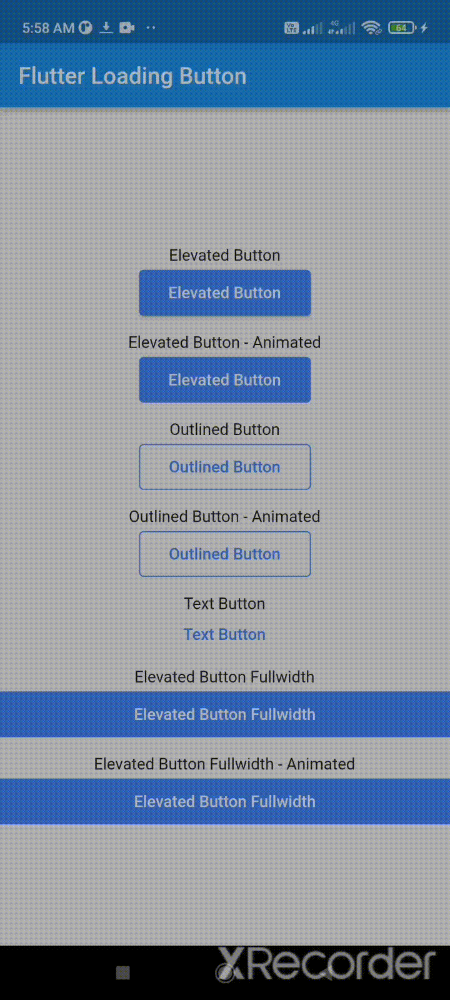

# easy_loading_button


[](https://github.com/usefulteam/easy_loading_button/issues)
[](https://github.com/usefulteam/easy_loading_button/blob/master/LICENSE)

**easy_loading_button** is a free and open source (MIT license) Material Flutter Button that supports variety of buttons style demands. It is designed to be easy to use and customizable.


Or try the [demo on DartPad](https://dartpad.dev/?id=7a5db7e083ecba0362e08603d62c5aec)

> Note:
> 
> In the DartPad version, our use of `CircularProgressIndicator` as the `loadingStateWidget` is not well-displayed.
> 
> But it's fine when using it in mobile phone (Android, in our test).

## Get started

### **Depend on it**

Add this to your package's `pubspec.yaml` file:

```yaml
easy_loading_button: ^0.2.2
```

### **Install it**

You can install packages from the command line:

```
$ flutter pub get
```

Alternatively, your editor might support flutter pub get.

### **Import it**

Now in your Dart code, you can use:

```dart
import 'package:easy_loading_button/easy_loading_button.dart';

```

## How to use

Add `EasyButton` to your widget tree:

```dart
EasyButton(
  type: EasyButtonType.elevated,
  // Content inside the button when the button state is idle.
  idleStateWidget: const Text(
    'Elevated Button',
    style: TextStyle(
      color: Colors.white,
    ),
  ),
  // Content inside the button when the button state is loading.
  loadingStateWidget: const CircularProgressIndicator(
    strokeWidth: 3.0,
    valueColor: AlwaysStoppedAnimation<Color>(
      Colors.white,
    ),
  ),
  // Whether to animate the button width or not.
  useWidthAnimation: false,
  // Whether or not to force the loadingStateWidget to have equal dimension when useWidthAnimation is set to false.
  // This is useful when you are using CircularProgressIndicator as the loadingStateWidget.
  // This parameter will be ignored when useWidthAnimation value is true.
  useEqualLoadingStateWidgetDimension: true,
  // If you want a fullwidth size, set this to double.infinity
  width: 150.0,
  height: 40.0,
  borderRadius: 4.0,
  // The elevation of the button.
  // This will only be applied when the type parameter value is EasyButtonType.elevated
  elevation: 0.0,
  // The gap between button and it's content.
  // This will be ignored when the `type` parameter value is set to `EasyButtonType.text`
  contentGap: 6.0,
  // Color for the button.
  // For [EasyButtonType.elevated]: This will be the background color.
  // For [EasyButtonType.outlined]: This will be the border color.
  // For [EasyButtonType.text]: This will be the text color.
  buttonColor: Colors.blueAccent,
  onPressed: () {},
),
```

More parameters:
```dart
const EasyButton({
  Key? key,
  required this.idleStateWidget,
  required this.loadingStateWidget,
  this.type = EasyButtonType.elevated,
  this.useWidthAnimation = true,
  this.useEqualLoadingStateWidgetDimension = true,
  this.width = double.infinity,
  this.height = 40.0,
  this.contentGap = 0.0,
  this.borderRadius = 0.0,
  this.elevation = 0.0,
  this.buttonColor = Colors.blueAccent,
  this.onPressed,
}) : super(key: key);
```

Three types supported:
```dart
enum EasyButtonType {
    elevated,
    outlined,
    text,
}
```

## Source
Source code and example of this library can be found in git:

```
$ git clone https://github.com/usefulteam/easy_loading_button.git
```

## License
[MIT License](https://oss.ninja/mit?organization=Useful%20Team)

## Credits
Thanks to [Yang JIANG](https://github.com/jiangyang5157) for the `flutter_progress_button` package. My package was based on it.
- [flutter_progress_button on GitHub](https://github.com/jiangyang5157/flutter_progress_button)
- [flutter_progress_button on pub.dev](https://pub.dev/packages/flutter_progress_button)
